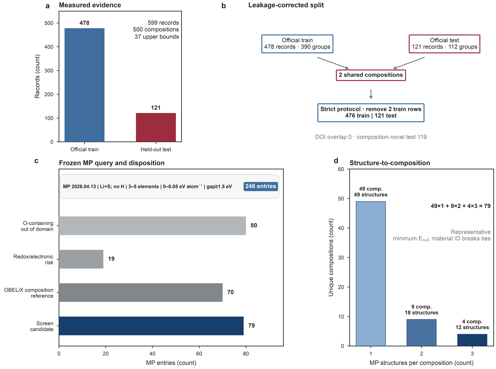
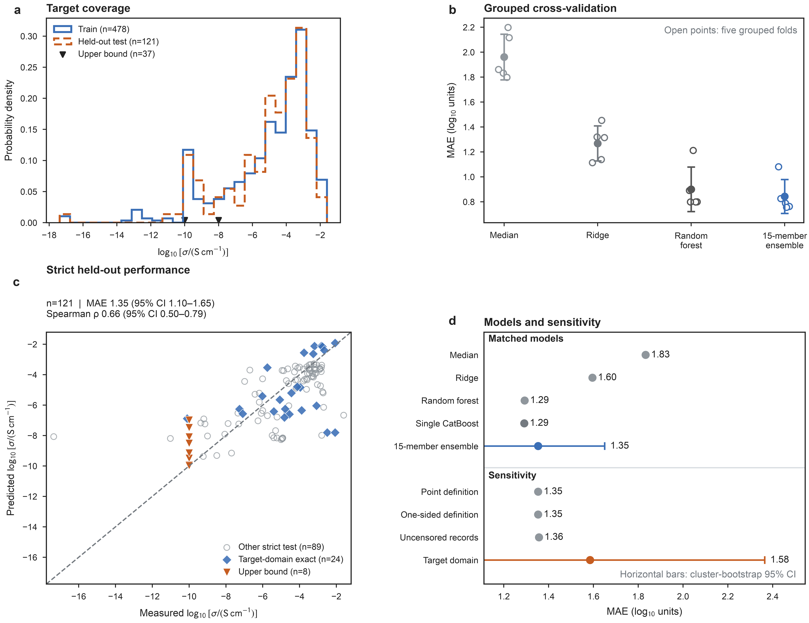
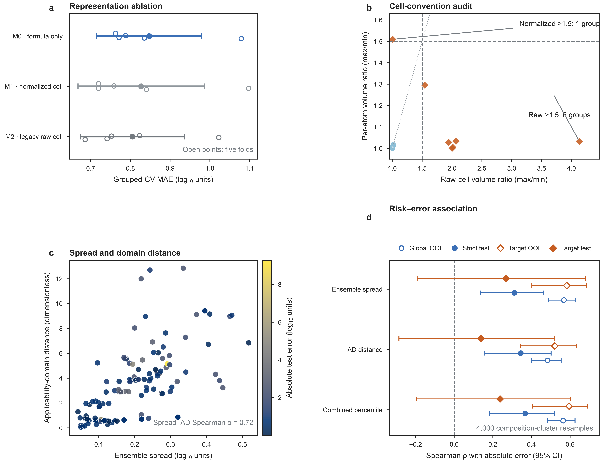
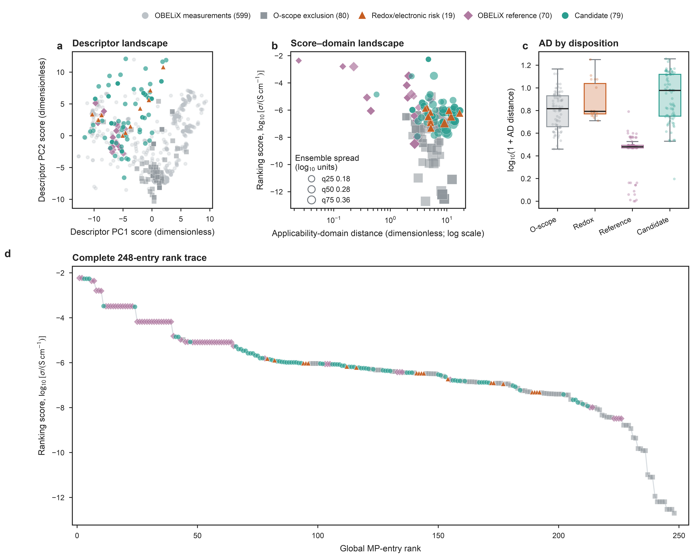
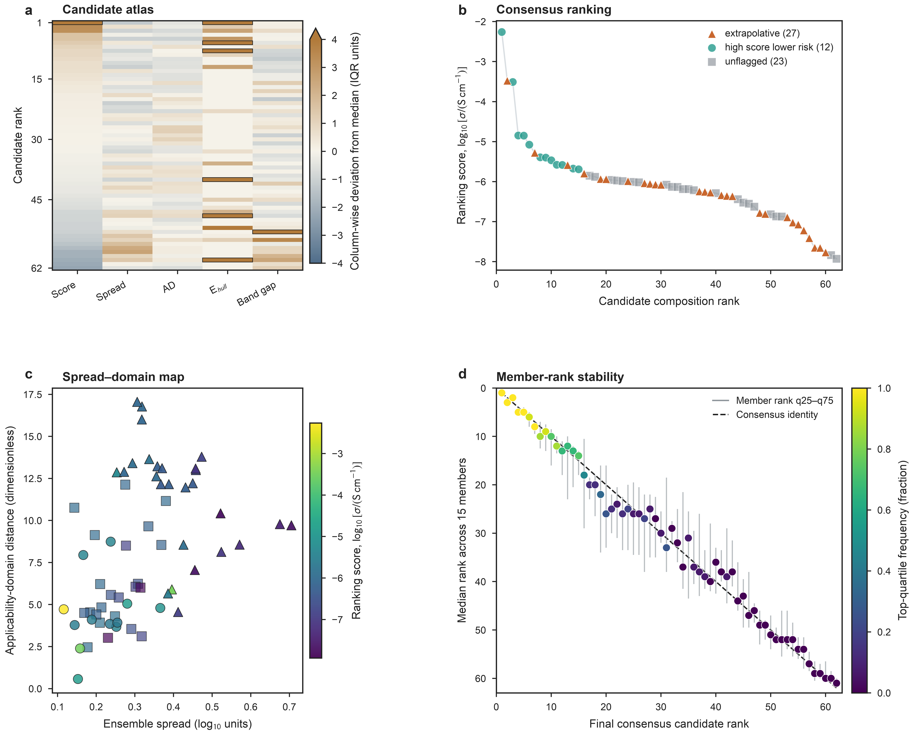
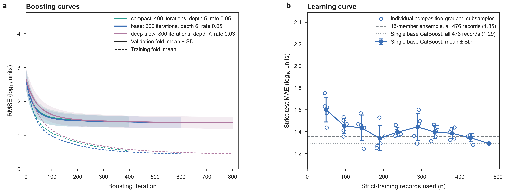

# Main-figure contract and stand-alone legends

The main text contains exactly five figures; one supplementary figure (S1) is
rendered to `figures/supplementary/` under the same contract. `p1screen figures`
is the sole renderer. It exports 7.2 in wide, 900 dpi, RGB, pure-white,
grid-free PNG files only.
All panels are generated from frozen CSV tables under `source_data/` plus
`data/metrics.json`; no plotted value is typed into the renderer.
Typography, panel sizing, accessible colours, redundant marker shapes, and maximum
height follow Nature's visual guidance. A low-saturation semantic palette uses
blue for training/models, vermillion for testing/risk, teal for candidates,
mauve for OBELiX references, and grey for supporting evidence; shapes and line
styles repeat every categorical distinction. The author-selected PNG-only
contract is not a substitute for Nature's editable-vector requirement at final
production.

## Source map

| Figure | Question | Quantitative sources |
|---|---|---|
| 1 — Study design | Is every experimental and MP record accounted for? | `fig01b_split_audit.csv`, `fig01c_mp_query_contract.csv`, `fig01c_mp_disposition.csv`, `fig05_candidate_queue.csv` |
| 2 — Validation | Does performance survive grouped and strict testing? | `fig02a_targets.csv`, `fig02b_grouped_cv.csv`, `fig02c_test_predictions.csv`, `fig02d_censor_sensitivity.csv`, `fig02e_strict_baselines.csv` |
| 3 — Transfer and risk | Why use formula-only features, and where does error rise? | `fig03a_representation_ablation.csv`, `fig03b_cell_convention.csv`, `fig03c_risk_correlations.csv`, `fig02c_test_predictions.csv` |
| 4 — Global screen | Where do all 248 MP entries lie? | `fig04a_descriptor_projection.csv`, `fig04_screen_ledger.csv` |
| 5 — Candidate atlas | What is the complete 62-composition result, and is its ordering stable? | `fig05_candidate_queue.csv` |
| S1 — Training diagnostics (supplementary) | Are the boosting budgets reasonable, and is the training set large enough? | `figS1a_boosting_curves.csv`, `figS1b_learning_curve.csv` |

Two further tables are released under `source_data/` as supplementary data but
are not read by any figure: `fig02f_training_sensitivity.csv` (training-weighting
and censor-exclusion sensitivities, summarized in `data/metrics.json`) and
`fig03d_oof_risk.csv` (record-level out-of-fold risk signals that
`fig03c_risk_correlations.csv` aggregates).

## Figure 1 — Study design and exhaustive accounting

**Conclusion.** Project 1 preserves a complete chain from 599 measured records
to 248 queried MP entries and 62 candidate compositions, while correcting a
previously hidden composition overlap in the official data split.

**Legend.** **a,** OBELiX contains 478 official training and 121 official test
records (599 total; 500 normalized compositions). Thirty-seven records are
one-sided upper bounds. **b,** Scale-invariant composition keys identify two
composition groups shared across the official train and test sets. Strict
held-out evaluation removes the two corresponding training rows and retains
476 train / 121 test records. The test contains 119 composition-novel records;
DOI overlap is zero. **c,** The frozen MP query contract requires Li and S,
excludes H, permits 3–5 elements, restricts energy above hull to 0–0.05 eV per
atom, requires a band gap of at least 1.5 eV, and records database version
`2026.04.13`. It yields 248 entries, exhaustively assigned as 80 oxygen-scope
exclusions, 19 redox/electronic-risk entries, 70 OBELiX-composition references,
and 79 screen-candidate structure entries. **d,** The 79 structures represent
62 unique normalized compositions: 49 compositions have one structure, nine
have two, and four have three (`49×1 + 9×2 + 4×3 = 79`). The representative is
the entry with minimum energy above hull, with material ID breaking ties.

**Boundary.** Composition grouping and representative selection are accounting
rules; they do not assign compute or experimental priority.

## Figure 2 — Statistical validation

**Conclusion.** The formula-only ensemble learns reproducible CV rank structure,
but does not outperform the simpler matched models on the strict test; both the
full and target-domain errors require ranking-only interpretation.

**Legend.** **a,** Distribution of measured log10 ionic conductivity for the
official train and held-out test splits, shown as solid blue and long-dashed
vermillion outlines, respectively. Downward triangles mark all 37 one-sided
upper-bound records. **b,** Five-fold composition-grouped CV on the
official training split using identical folds for the median, ridge, random
forest, and 15-member perturbation ensemble. Open symbols are folds; filled
symbols and whiskers are mean ± sample SD. The ensemble gives MAE
0.843 ± 0.136. **c,** Predicted versus measured values for the strict 121-record
held-out test. Hollow grey circles are other exact records, filled blue diamonds
are exact target-domain records, vermillion downward triangles are the eight
upper bounds, and the dashed line is identity. The separate metric strip reports MAE 1.353
(cluster-bootstrap 95% CI 1.100–1.650) and Spearman ρ 0.660
(0.499–0.786). **d,** Horizontal points compare the five matched strict-test
models and four censor/target-scope definitions. Horizontal whiskers are shown
where composition-cluster bootstrap intervals are available. Random-forest and
single-base-CatBoost MAEs are 1.293 and 1.291, versus 1.353 for the ensemble;
the target-domain MAE is 1.585 (0.961–2.365). The ensemble-minus-single-CatBoost
MAE difference is 0.062 (paired 95% interval 0.020–0.106), so the strict test
does not support an ensemble performance advantage.

**Boundary.** The held-out test is not used for feature selection, model fitting,
or threshold definition. Censored values are not treated as exact physical
measurements in the sensitivity analysis.

## Figure 3 — Representation transfer and empirical risk

**Conclusion.** Structural fields provide a small same-dataset benefit but carry
cell-convention ambiguity and are unavailable for formula-only transfer. Spread
and AD are related risk heuristics whose strict target-domain evidence is weak.

**Legend.** **a,** Matched five-fold composition-grouped ablation of M0
(134 formula features), M1 (143 features with scale-invariant cell summaries),
and M2 (144 legacy raw-cell features). M0 MAE is 0.847 ± 0.133, M1 is
0.827 ± 0.159, and M2 is 0.805 ± 0.131. **b,** For 56 repeated-composition
groups, raw cell-volume max/min ratios reach 4.13 and exceed 1.5 in six groups.
After scaling to volume per atom, the maximum is 1.51 and one group remains
above 1.5. Hollow blue circles are within the thresholds and filled vermillion
diamonds exceed at least one threshold; dashed lines mark the 1.5 cut-offs and
the dotted line marks equality of the two ratios. **c,** Strict-test ensemble
spread versus AD distance, coloured by
absolute error using a perceptually ordered colour scale. **d,** Forest plot of
the Spearman association of spread, AD distance, and their combined percentile
with absolute error. Circles denote the global sample and diamonds the target
domain; blue and vermillion repeat this distinction, while open points denote
grouped OOF estimates and filled points denote the strict test. Horizontal
whiskers are 95% composition-cluster bootstrap intervals from
4,000 resamples. The global OOF, strict-test, target-OOF, and target-test samples
contain 478/390, 121/112, 117/97, and 24/23 records/compositions, respectively.
Full strict-test correlations are 0.311, 0.345, and 0.367; target-test values are
0.267, 0.139, and 0.237. Spread and AD are correlated in the strict test
(ρ = 0.722), as annotated in panel c.

**Boundary.** M1 and M2 are diagnostic ablations only. Production ranking uses
M0, the sole representation with an exact experiment-to-MP data contract.
Neither spread nor AD distance is a calibrated confidence interval.

## Figure 4 — Global Materials Project screening landscape

**Conclusion.** The full MP population is visible in descriptor, ranking, and
risk space, and every entry remains traceable to a single explicit disposition.

**Legend.** **a,** First two principal components of the standardized M0
descriptor space fitted on all 599 OBELiX records. Grey points are measurements;
coloured points are all 248 MP entries split by disposition. Colours and marker
shapes are fixed across panels. **b,** Ranking score versus dimensionless AD
distance on a logarithmic axis for all MP entries; marker area is proportional
to ensemble spread in log10 units, with q25/median/q75 size keys. The displayed
area mapping spans approximately 12–60 pt² without clipping the spread values.
**c,** AD-distance distributions by disposition; boxes are accompanied
by all individual entries so no outliers are hidden. **d,** Full-width 248-entry
rank trace coloured and shaped by disposition. The production score is the mean
of 15 CatBoost members spanning three model configurations and five seeds each.

**Boundary.** The score is a learned ranking statistic, not calibrated
conductivity. PCA proximity does not establish chemical similarity in every
physically relevant dimension.

## Figure 5 — Complete candidate atlas

**Conclusion.** All 62 candidate compositions are presented as a population,
and their final consensus ordering can be compared directly with the rank
distribution across all 15 ensemble members.

**Legend.** **a,** Column-wise median/IQR atlas of ranking score, ensemble spread,
AD distance, minimum energy above hull, and maximum band gap, ordered by
candidate rank. Colour encodes direction and magnitude relative to each column's
median, not desirability, safety, or evidence state. Eight cells exceed the +4
display limit—one score, six energy-above-hull, and one band-gap cell—and are
shown with dark outlines and the extended upper colour scale; exact values remain
in the source table. Every row is one normalized composition; formulas are
available in the source table but are intentionally not promoted in the main figure.
**b,** Complete score trace coloured and shaped by q75 evidence state. **c,**
Ensemble spread versus AD distance coloured by ranking score; marker shapes use
the same evidence-state mapping as panel b. **d,** Final consensus rank versus
median member rank for all 62
compositions. Vertical bars span member-rank q25–q75, the dashed diagonal marks
exact agreement with the consensus ordering, and colour gives the fraction of
the 15 members that place the composition in the top quartile.

At q75, 27 compositions are extrapolative (spread or AD at/above q75), 12 are
high-score/lower-risk (score at/above q75 without extrapolative status), and 23
are unflagged. The q70/q75/q80 count sensitivity remains machine-readable in
`data/model_manifest.json`; it is not used to redefine the displayed ordering.

**Boundary.** Thresholds summarize the candidate population. They do not imply
novelty, stability, high conductivity, or a recommended experimental sequence.

## Supplementary Figure S1 — Training diagnostics

**Conclusion.** None of the three boosting budgets is over-trained, and the
strict-test error has not saturated at the full 476-record training set. Both
curves are descriptive: they were computed after the evaluation protocol was
frozen and do not revise any reported result.

**Legend.** **a,** Fold-mean RMSE versus boosting iteration for the compact
(teal), base (blue), and deep-slow (mauve) configurations, each fitted once per
grouped fold with model seed 42 and `use_best_model=False` so the full
trajectory is retained. Solid lines are validation-fold RMSE with ±1 SD bands
across the five folds; dashed lines are training-fold RMSE. Validation RMSE
falls from about 2.62 at the first iteration to 1.398, 1.379, and 1.369 at the
400-, 600-, and 800-iteration budgets, while training RMSE ends at 0.547,
0.449, and 0.451. Validation RMSE is essentially flat beyond roughly iteration
250, and its fold-mean minimum still falls within the final iterations of every
budget (395, 591, and 799). The training-validation gap therefore widens
throughout without validation error degrading: the budgets are long enough to
converge and short enough not to over-train, and a longer budget would return
only marginal gains. **b,** Strict-test MAE of the single base
CatBoost versus the number of strict-training records after composition-grouped
subsampling at fractions 0.1–1.0 of the 388 strict-training compositions. Open
circles are the five subsampling seeds per fraction; filled circles and whiskers
are mean ± SD. Mean MAE falls from 1.602 (SD 0.114) at about 49 records to 1.291
at all 476, and the final step from about 428 records still lowers it from 1.344
to 1.291. The curve is not monotonic: fractions 0.4–0.8 fluctuate between 1.339
and 1.443, and the seed-to-seed SD (0.038–0.120) is comparable with the
differences between adjacent fractions. Dashed and dotted reference lines mark
the full-data 15-member ensemble (1.353) and single base CatBoost (1.291) from
Figure 2d. Strict-test Spearman rho rises from 0.455 to 0.657 over the same
range; per-subsample values are in the source table.

**Boundary.** These diagnostics do not select hyperparameters, thresholds, or
candidates. Panel b uses one CatBoost rather than the 15-member ensemble, so its
level matches the single-model baseline in Figure 2d, not the headline ensemble.
Because the curve has not flattened, it gives no evidence that the training set
has saturated; its scatter is also too large to predict how much a specific
increase in data would help.
