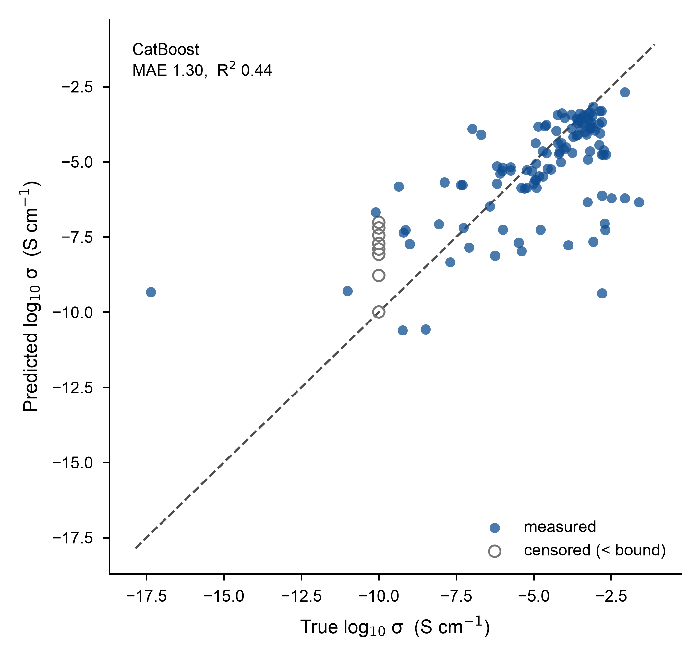
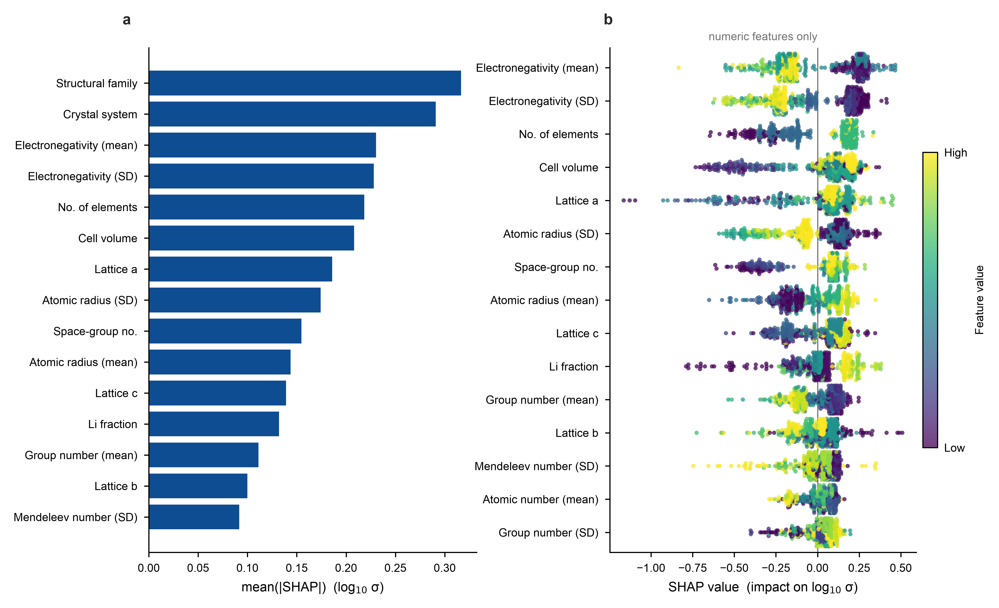

# Project 1 — Data-Driven Ionic-Conductivity Screening (OBELiX)

A small, honest ML project: predict room-temperature Li-ion conductivity of
solid electrolytes from composition + crystallography, and explain *what the
model keys on* with SHAP. Positioned as the **first layer of a screening
funnel**, not a precise predictor.

> Part of the AI4SSB portfolio (Project 1 / "appetizer"). Flagship is the
> Li₆PS₅Cl MLIP-MD conductivity study (Project 2).

## Data
[OBELiX](https://github.com/NRC-Mila/OBELiX) — 599 experimental entries
(478 train / 121 test, **official split** to avoid leakage). Target =
`log10(ionic conductivity / S cm⁻¹)`.

## Method
- **Features** (`src/featurize.py`): a hand-built *Magpie-lite* composition
  descriptor set — fraction-weighted mean/std/min/max/range of element
  properties (Z, mass, electronegativity, row, group, Mendeleev #, atomic
  radius) + Li fraction + n_elements — plus crystallography (a/b/c/angles,
  cell volume, space-group #, Z) and two categoricals (Family, crystal
  system). No matminer dependency, so every feature is explainable.
- **Models**: CatBoost (native categorical handling, NaN-safe) vs a
  RandomForest baseline (median impute + one-hot). Small, noisy data → trees,
  **not GNNs** (consistent with the OBELiX benchmark).
- **Evaluation**: 5-fold CV on train, then a single held-out test evaluation.

## Results (log10 S/cm)
| | CV MAE | CV R² | Test MAE | Test R² |
|---|---|---|---|---|
| **CatBoost**   | 0.82 ± 0.07 | 0.76 ± 0.04 | **1.30** | **0.44** |
| RandomForest   | 0.85 ± 0.07 | 0.72 ± 0.04 | 1.42 | 0.37 |

CatBoost wins on both. **The CV→test gap (R² 0.76 → 0.44) is real and
reported, not hidden** — the official test split is a harder distribution;
treat single-number predictions with caution.



### What the model learns (SHAP)
Top drivers: **structural Family** and **crystal system**, then **mean
electronegativity** and **cell volume / lattice size**. Sanity check: median
conductivity by family ranks **LGPS and argyrodites (Li₆PS₅Cl family)
highest** — the known superionic classes — so the model has learned real
chemistry, not noise. See also `figures/01_eda.png`; full captions in [FIGURES.md](FIGURES.md).



## Honest limitations
- Experimental conductivities are small and noisy; the **same material can
  differ by an order of magnitude across papers**.
- **Censored values** (`<1E-10`, 29 in train) are parsed to their numeric
  bound and flagged — a known approximation.
- Composition features **cannot distinguish polymorphs**.
- This is a coarse pre-filter (≈1 order-of-magnitude error), useful for
  ranking candidates, **not** for quantitative conductivity.

## Reproduce
```bash
python -m venv .venv && source .venv/bin/activate   # Windows: .venv\Scripts\activate
pip install -r requirements.txt

python 01_train_eval.py         # data → CV → test → data/metrics.json + figures
python 02_shap.py               # SHAP importance + beeswarm
python 04_screen_mp.py --demo   # rank known sulfide SEs, no API key
python 04_screen_mp.py --api-key <KEY>   # live Materials Project screen
```
Data auto-downloads to `data/` on first run from the OBELiX repo. Python ≥ 3.10.

## Screening funnel (`04_screen_mp.py`)
Applies the trained model as a **coarse conductivity prior to rank candidates**,
not to predict absolute σ. Two modes:
- `--demo` (no key): featurizes well-characterised sulfide electrolytes from
  their approximate experimental cells. Sanity check passes — **LGPS and
  argyrodites top the list, Li₂S sinks to the bottom**, matching the SHAP family
  ranking (`figures/04_screen_demo.png`). It also honestly exposes the model's
  coarseness: Li₇P₃S₁₁ (a real superionic) ranks low because OBELiX's `sulfides`
  family has only 7 examples — the same ≈1-order-of-magnitude limitation noted above.
- live (`--api-key` / `$MP_API_KEY` / `mp_api_key.txt`): queries Materials Project
  for Li–S candidates, featurizes, ranks them into `screen_mp_results.csv` +
  `figures/05_screen_mp.png`. **Verified**: a blind MP query puts the LGPS family
  (Li₁₀Ge/Si/SnP₂S₁₂) at ranks 1–3 — matching the SHAP family ranking.

Since `Family` is OBELiX's strongest feature but unavailable for MP entries, it is
assigned only by a **transparent stoichiometry heuristic** (argyrodite Li₆PS₅X,
LGPS Li₁₀MP₂S₁₂, thio-LISICON LiₓMS₄, Li₃PS₄/Li₇P₃S₁₁); novel chemistries fall back
to `unknown` (an unseen CatBoost category) and score on composition + structure
alone. The assigned family is written to the CSV so every score is auditable.

### Audit-driven candidate filters (see [`screen_audit.md`](screen_audit.md))
The composition+structure features are **blind to electronic conductivity and
electrochemical role**, so an initial loose run surfaced three classes of
false hits. Each top-15 hit was adversarially audited against literature; the fixes
are now baked into the query:
- `exclude_elements=["H"]` — drops hydrate / ammonium / oxysalt artifacts
  (Li₃SbS₄·9H₂O, Li(NH₄)SO₄ — whose "S" is a *sulfate*, not sulfide).
- drop redox-active TM sulfides {V,Cr,Mn,Fe,Co,Ni,Cu,Mo,W} + `band_gap ≥ 1.5` —
  demotes mixed ionic-electronic conductors / cathodes (Li₃CuS₂, Li₈CrS₆, Li₃NbS₄).
- `num_elements ≥ 3` — drops binary precursors (Li₂S, ~1e-13 S/cm, no Li path).

The audit confirmed the LGPS top-3 as real superionics and surfaced two clean,
literature-blank leads — **Li₂₀Si₃P₃S₂₃Cl** and **Li₈TiS₆** — for Project 2 MD.

## Next
- Hand the two audited leads (Li₂₀Si₃P₃S₂₃Cl, Li₈TiS₆) to Project 2 (MLIP-MD) for
  quantitative validation — the funnel *ranks*, MD *certifies*.
- Feed Project 3 (generative) candidates through this model for ranking.

## Data & credit
Data: **OBELiX** (Therrien et al., *Digital Discovery*, 2026,
[10.1039/D5DD00441A](https://doi.org/10.1039/D5DD00441A);
[arXiv:2502.14234](https://arxiv.org/abs/2502.14234);
[repo](https://github.com/NRC-Mila/OBELiX)). The dataset is downloaded from the
original repository at runtime and is not redistributed here. Their reported RF
baseline is MAE ≈ 1.6 (log₁₀ S/cm) with a label-noise floor of ≈ 0.4; this
project reaches a comparable test MAE of 1.30 with CatBoost.
